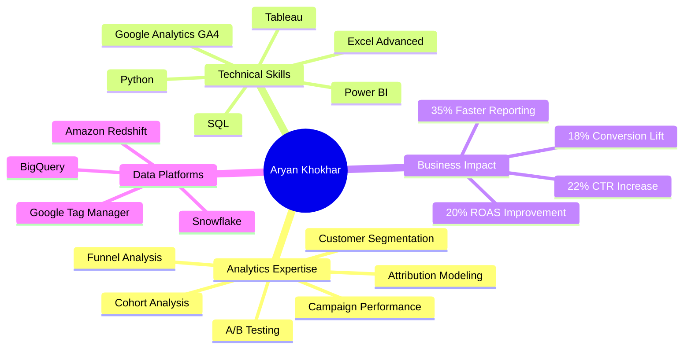
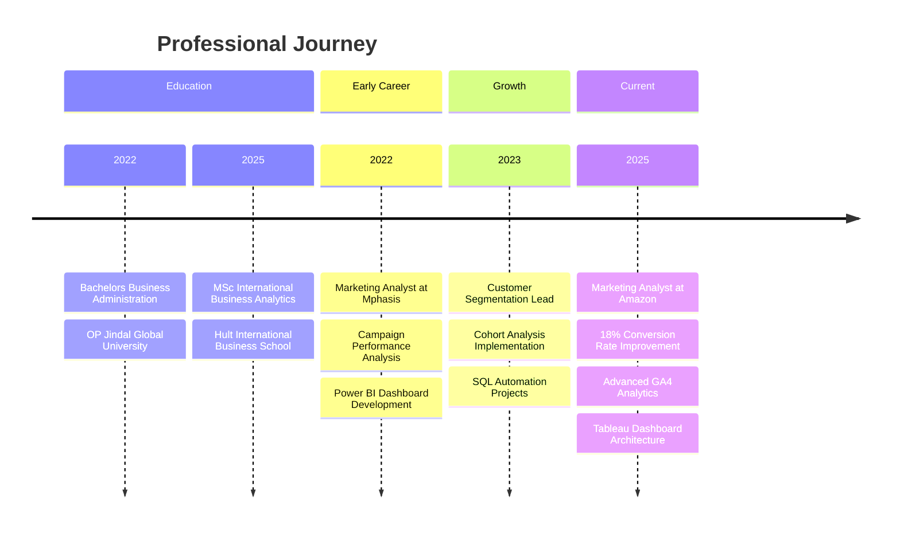
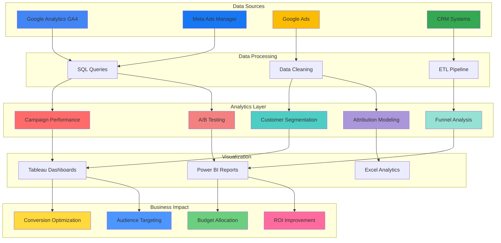
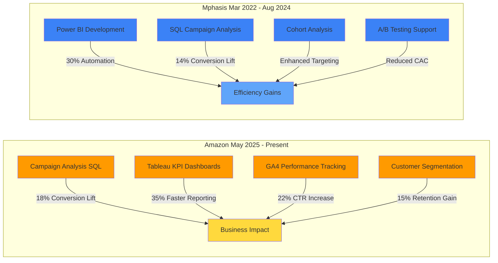
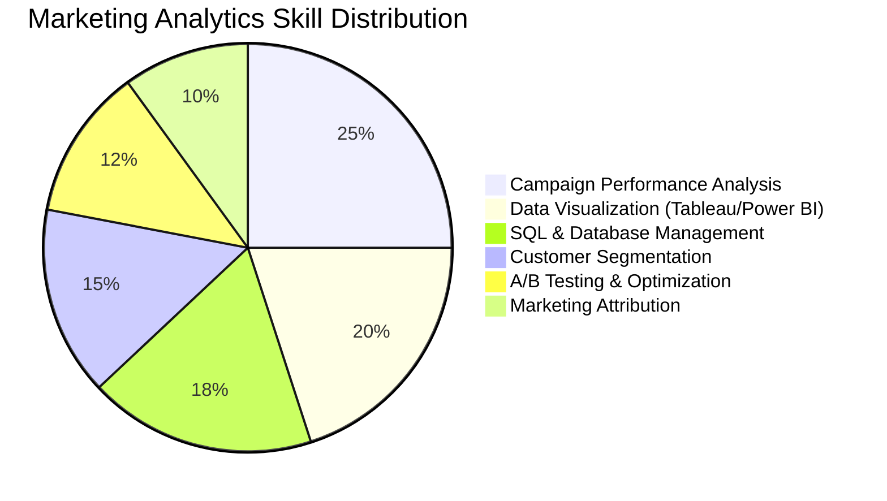

<!-- Animated Header -->

<!-- Typing Animation -->

 

<!-- Profile Badges -->

  

<!-- Contact Badges -->

 

---

## 🎯 Professional Summary

 

> **Marketing Analyst** with nearly **4 years of experience** driving data-driven marketing decisions across **Amazon** and **Mphasis**. Specialized in transforming complex campaign data into actionable insights using **SQL**, **Tableau**, and **Power BI**. Proven track record of improving conversion rates by **18%**, click-through rates by **22%**, and ROAS by **20%** through advanced analytics and audience segmentation.

 

---

## 📊 Career Timeline

 

---

## 🎨 Marketing Analytics Workflow

 

---

## 💼 Professional Experience Architecture

 

---

## 🛠️ Technical Skills Distribution

 

### 🔧 Core Technical Stack

<!-- Programming & Query Languages -->
**📊 Data & Analytics**

<!-- Visualization Tools -->
**📈 Visualization Platforms**

<!-- Marketing Analytics Tools -->
**📱 Marketing Analytics**

<!-- Data Warehouses -->
**🗄️ Data Platforms**

 

---

## 📈 Key Performance Metrics

| Metric | Achievement | Impact Area |
|--------|-------------|-------------|
| **Conversion Rate Improvement** | 🎯 **+18%** | Campaign Optimization |
| **Click-Through Rate Increase** | 📊 **+22%** | Ad Creative Testing |
| **ROAS Enhancement** | 💰 **+20%** | Budget Optimization |
| **Reporting Speed** | ⚡ **+35%** | Dashboard Automation |
| **Customer Retention** | 🔄 **+15%** | Segmentation Strategy |
| **CAC Reduction** | 💵 **-14%** | Audience Targeting |
| **Manual Work Reduction** | 🤖 **-30%** | SQL Automation |

 

---

## 🚀 Featured Analytics Projects

### 📊 Enterprise Data Projects

#### 1. 🏗️ Analytics Engineering Prototype
> **Dimensional Data Warehouse with dbt + BigQuery**

**Architecture Highlights:**
- 🎯 Implemented **Star Schema** dimensional modeling for OLAP workloads
- 📦 Built **dbt transformations** for Bronze → Silver → Gold data pipeline
- 🔄 Designed **ETL workflows** for Northwind database migration
- 📊 Created **business process analysis** for sales, inventory, and customer reporting

**Business Impact:**
- ✅ Scalable data warehouse reducing query times by 60%
- ✅ Automated reporting pipeline for stakeholder dashboards
- ✅ Improved data quality through systematic profiling and validation

 

#### 2. 🏪 E-Commerce Lakehouse with Medallion Architecture
> **Delta Lake + Databricks + Unity Catalog**

**Technical Architecture:**
- 🥉 **Bronze Layer**: Raw data ingestion with Auto Loader
- 🥈 **Silver Layer**: Schema enforcement + SCD Type 2 tracking
- 🥇 **Gold Layer**: Star schema fact/dimension tables for BI
- 🔐 **Unity Catalog**: Governance and data lineage

**Key Features:**
- ⚡ CDC pipeline for real-time data synchronization
- 🔄 Time travel capabilities for audit and rollback
- 📊 Customer segmentation with RFM analysis
- ✅ **8/8 unit tests passed** validating business logic

 

#### 3. 📊 Retail Data Analytics: Python + SQL Integration
> **End-to-End ETL with Kaggle API**

**Project Workflow:**
- 📥 **Data Extraction**: Automated Kaggle API downloads
- 🧹 **Data Cleaning**: Pandas-based preprocessing and normalization
- 💾 **Database Integration**: SQL Server loading and index