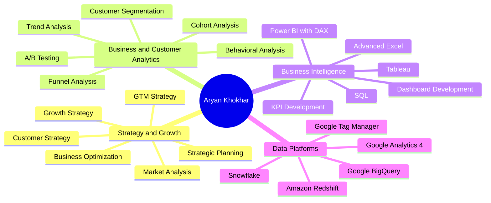
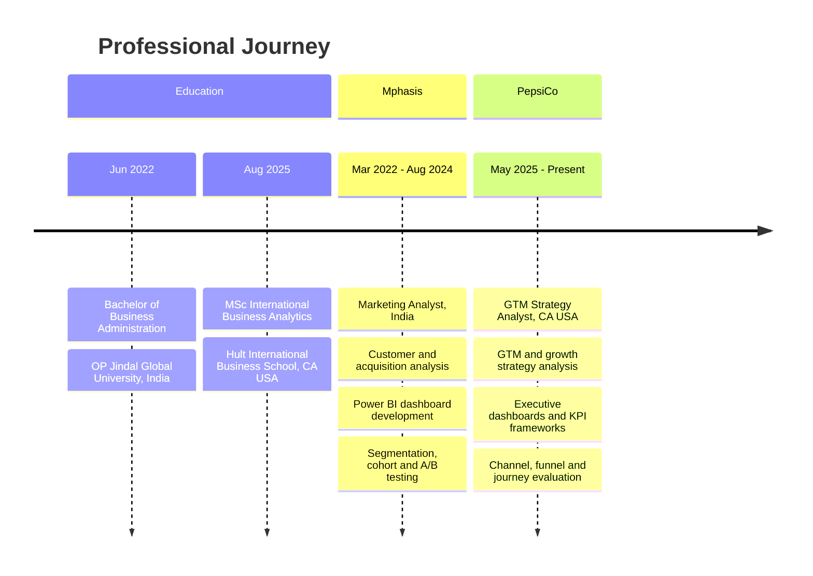
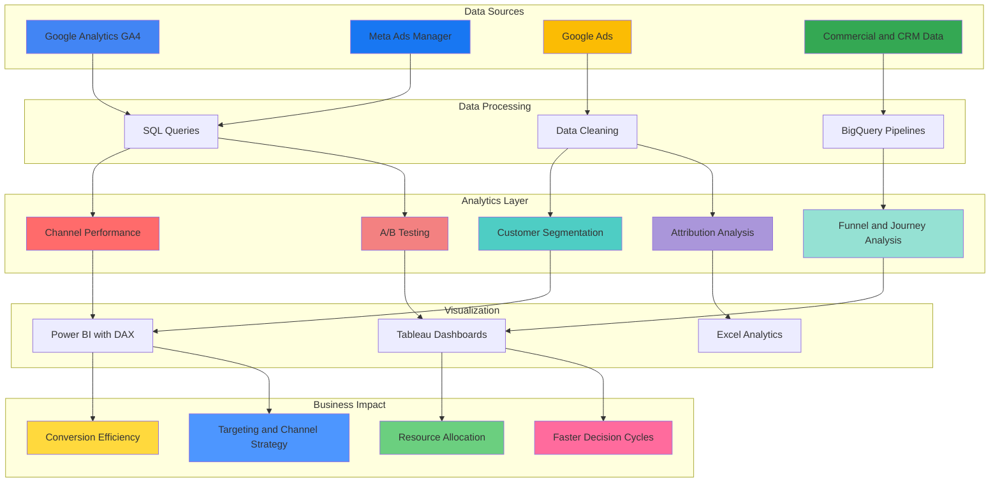
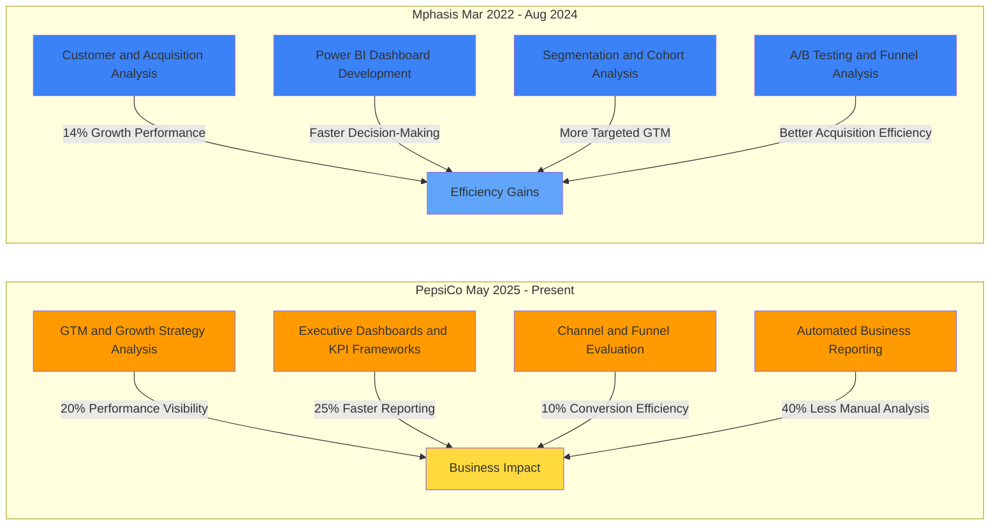
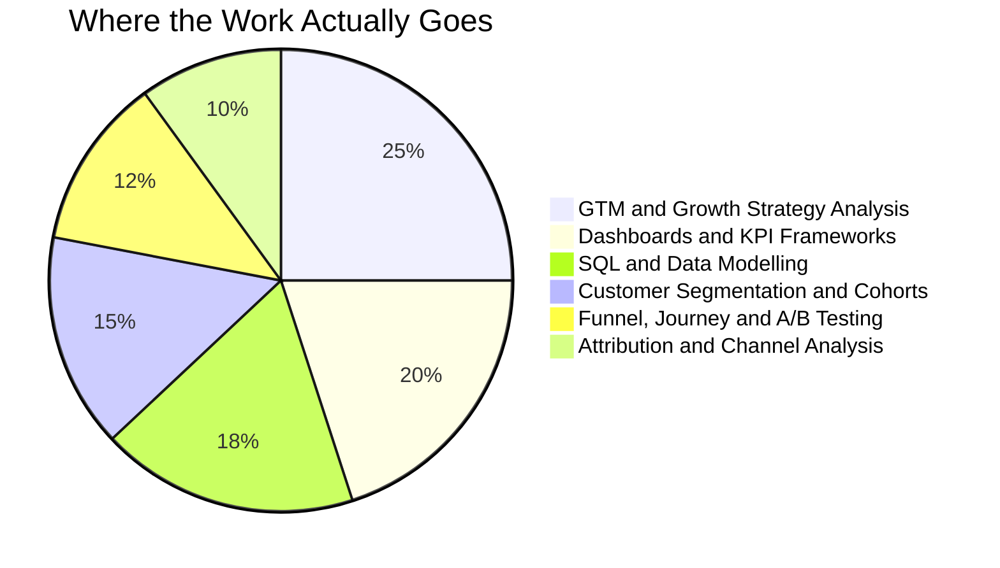

<!-- Animated Header -->

<!-- Typing Animation -->

 

<!-- Profile Badges -->

  

<!-- Contact Badges -->

 

---

## 🎯 Professional Summary

```mermaid
mindmap
  root((Aryan Khokhar))
    Strategy and Growth
      GTM Strategy
      Growth Strategy
      Market Analysis
      Customer Strategy
      Strategic Planning
      Business Optimization
    Business and Customer Analytics
      Customer Segmentation
      Cohort Analysis
      Behavioral Analysis
      Funnel Analysis
      Trend Analysis
      A/B Testing
    Business Intelligence
      SQL
      Power BI with DAX
      Tableau
      Advanced Excel
      KPI Development
      Dashboard Development
    Data Platforms
      Google BigQuery
      Snowflake
      Amazon Redshift
      Google Analytics 4
      Google Tag Manager
```

 

> **GTM & Marketing Strategy Analyst** with nearly **4 years of experience** in GTM strategy, growth strategy, market analysis, customer insights, and business performance across **PepsiCo** and **Mphasis**. Skilled in **SQL**, **Power BI**, **Tableau**, **GA4**, **Google BigQuery**, and **Excel** to analyze trends, identify growth opportunities, and support strategic decision-making. Experienced in GTM planning, customer segmentation, business optimization, KPI analysis, and cross-functional strategy execution — translating data-driven insights into recommendations that support business growth and operational performance.

 

---

## 📊 Career Timeline

```mermaid
timeline
    title Professional Journey
    section Education
      Jun 2022 : Bachelor of Business Administration
               : OP Jindal Global University, India
      Aug 2025 : MSc International Business Analytics
               : Hult International Business School, CA USA
    section Mphasis
      Mar 2022 - Aug 2024 : Marketing Analyst, India
                          : Customer and acquisition analysis
                          : Power BI dashboard development
                          : Segmentation, cohort and A/B testing
    section PepsiCo
      May 2025 - Present : GTM Strategy Analyst, CA USA
                         : GTM and growth strategy analysis
                         : Executive dashboards and KPI frameworks
                         : Channel, funnel and journey evaluation
```

 

---

## 🎨 GTM Analytics Workflow

```mermaid
flowchart TB
    subgraph Data Sources
        A1[Google Analytics GA4]
        A2[Meta Ads Manager]
        A3[Google Ads]
        A4[Commercial and CRM Data]
    end

    subgraph Data Processing
        B1[SQL Queries]
        B2[Data Cleaning]
        B3[BigQuery Pipelines]
    end

    subgraph Analytics Layer
        C1[Channel Performance]
        C2[Customer Segmentation]
        C3[Funnel and Journey Analysis]
        C4[A/B Testing]
        C5[Attribution Analysis]
    end

    subgraph Visualization
        D1[Power BI with DAX]
        D2[Tableau Dashboards]
        D3[Excel Analytics]
    end

    subgraph Business Impact
        E1[Conversion Efficiency]
        E2[Resource Allocation]
        E3[Targeting and Channel Strategy]
        E4[Faster Decision Cycles]
    end

    A1 --> B1
    A2 --> B1
    A3 --> B2
    A4 --> B3

    B1 --> C1
    B2 --> C2
    B3 --> C3
    B1 --> C4
    B2 --> C5

    C1 --> D1
    C2 --> D1
    C3 --> D2
    C4 --> D2
    C5 --> D3

    D1 --> E1
    D2 --> E2
    D1 --> E3
    D2 --> E4

    style A1 fill:#4285F4
    style A2 fill:#1877F2
    style A3 fill:#FBBC04
    style A4 fill:#34A853
    style C1 fill:#FF6B6B
    style C2 fill:#4ECDC4
    style C3 fill:#95E1D3
    style C4 fill:#F38181
    style C5 fill:#AA96DA
    style E1 fill:#FFD93D
    style E2 fill:#6BCF7F
    style E3 fill:#4D96FF
    style E4 fill:#FF6B9D
```

 

---

## 💼 Professional Experience Architecture

```mermaid
graph LR
    subgraph PepsiCo May 2025 - Present
        A1[GTM and Growth Strategy Analysis]
        A2[Executive Dashboards and KPI Frameworks]
        A3[Channel and Funnel Evaluation]
        A4[Automated Business Reporting]

        A1 -->|20% Performance Visibility| A5[Business Impact]
        A2 -->|25% Faster Reporting| A5
        A3 -->|10% Conversion Efficiency| A5
        A4 -->|40% Less Manual Analysis| A5
    end

    subgraph Mphasis Mar 2022 - Aug 2024
        B1[Customer and Acquisition Analysis]
        B2[Power BI Dashboard Development]
        B3[Segmentation and Cohort Analysis]
        B4[A/B Testing and Funnel Analysis]

        B1 -->|14% Growth Performance| B5[Efficiency Gains]
        B2 -->|Faster Decision-Making| B5
        B3 -->|More Targeted GTM| B5
        B4 -->|Better Acquisition Efficiency| B5
    end

    style A1 fill:#FF9A00
    style A2 fill:#FF9A00
    style A3 fill:#FF9A00
    style A4 fill:#FF9A00
    style A5 fill:#FFD93D
    style B1 fill:#3B82F6
    style B2 fill:#3B82F6
    style B3 fill:#3B82F6
    style B4 fill:#3B82F6
    style B5 fill:#60A5FA
```

 

---

## 🛠️ Technical Skills Distribution

```mermaid
pie title Where the Work Actually Goes
    "GTM and Growth Strategy Analysis" : 25
    "Dashboards and KPI Frameworks" : 20
    "SQL and Data Modelling" : 18
    "Customer Segmentation and Cohorts" : 15
    "Funnel, Journey and A/B Testing" : 12
    "Attribution and Channel Analysis" : 10
```

 

### 🔧 Core Technical Stack

<!-- Programming & Query Languages -->
**📊 Data & Analytics**

<!-- Visualization Tools -->
**📈 Visualization Platforms**

<!-- Marketing Analytics Tools -->
**📱 Digital & Analytics Platforms**

<!-- Data Warehouses -->
**🗄️ Data Platforms**

 

---

## 📈 Key Performance Metrics

| Metric | Achievement | Impact Area |
|--------|-------------|-------------|
| **Revenue & Marketing Performance Visibility** | 🎯 **+20%** | GTM & Growth Strategy Analysis |
| **Manual Analysis Reduction** | 🤖 **-40%** | Automated Business Reporting |
| **Reporting Time** | ⚡ **-25%** | Executive Dashboards & KPI Frameworks |
| **Cross-Functional Decision Cycles** | 🤝 **15% faster** | Strategy & Business Planning |
| **Resource Allocation Effectiveness** | 💰 **+15%** | Channel & Growth Prioritisation |
| **Customer Engagement** | 📊 **+12%** | Market, Customer & Behavioral Analysis |
| **Conversion Efficiency** | 🔄 **+10%** | Channel, Funnel & Journey Evaluation |
| **Business & Growth Performance** | 📈 **+14%** | Customer & Acquisition Analysis (Mphasis) |
| **Manual Reporting Effort** | 🧾 **-30%** | SQL & Excel Automation (Mphasis) |

 

---

## 🚀 Featured Analytics Projects

### 📊 Enterprise Data Projects

#### 1. 🏗️ Analytics Engineering Prototype
> **Dimensional Data Warehouse with dbt + BigQuery**

**Architecture Highlights:**
- 🎯 Implemented **star schema** dimensional modelling with `dim_customer`, `dim_product`, `dim_employee`, `dim_date` and `fact_sales`, `fact_inventory`, `fact_purchase_order`
- 📦 Built **dbt transformations** across staging, warehouse and one-big-table reporting layers
- 🔄 Designed **ETL workflows** over the Northwind OLTP source, documented with physical and logical ERDs
- 📊 Created **OBT reporting models** for sales overview, product inventory and customer reporting

 

#### 2. 🏪 E-Commerce Lakehouse with Medallion Architecture
> **Delta Lake + Databricks + Unity Catalog**

**Technical Architecture:**
- 🥉 **Bronze Layer**: raw ingestion from a Postgres CDC source
- 🥈 **Silver Layer**: schema enforcement, cleansing and **SCD Type 2** change tracking
- 🥇 **Gold Layer**: aggregate marts including daily revenue, orders and **customer RFM** facts
- 🔐 **Unity Catalog**: catalog and schema governance across bronze, silver and gold

**Key Features:**
- ⚡ dbt models on `dbt-databricks` for the mart layer
- 🧪 Great Expectations data-quality checks alongside the pipeline
- 📊 Customer value segmentation and RFM scoring
- ✅ **8/8 unit tests passing** on the silver transforms

 

#### 3. 📊 Retail Data Analytics: Python + SQL Integration
> **End-to-End ETL with the Kaggle API**

**Project Workflow:**
- 📥 **Data Extraction**: automated Kaggle API download and unzip of the retail orders dataset
- 🧹 **Data Cleaning**: pandas preprocessing, null handling and column normalisation
- 💾 **Database Integration**: load into SQL Server for querying
- 📈 **Analysis**: SQL queries over sales, profit and shipping dimensions to surface product and regional trends

 

#### 4. 📡 Cross-Channel Ads Dashboard
> **Unified Paid-Media Reporting across Facebook, Google and TikTok**

**What It Does:**
- 🔗 Unifies **Facebook, Google and TikTok Ads** data into a single reporting view
- 📊 Interactive spend, conversion and channel-performance breakdowns
- 🚀 Deployed as a production-ready Plotly Dash application

 

---

## 📂 More Work

| Project | Focus |
|---|---|
| [Customer Trends Analysis](https://github.com/aryan131199/customer-trends-data-analysis-sql-python-powerbi) | SQL extraction → Python exploration → Power BI reporting |
| [Customer Segmentation](https://github.com/aryan131199/data-analytics-customer-segmentation) | Behavioural and transactional segmentation for targeting |
| [Cohort Analysis](https://github.com/aryan131199/cohort_analysis) | Retention and repeat behaviour across acquisition cohorts |
| [Multi-Source Marketing Analytics](https://github.com/aryan131199/multi-source-marketing-analytics) | Blending acquisition sources into one reporting layer |
| [Sales Insights](https://github.com/aryan131199/sales-insights-data-analysis-using-tableau-and-sql) | SQL + Tableau revenue and regional analysis |
| [Tableau & Power BI Dashboards](https://github.com/aryan131199/dashboards-development-using-tableau-and-powerbi) | KPI, conversion and performance dashboard patterns |
| [Power BI Portfolio](https://github.com/aryan131199/powerbi-portfolio) | Reports and DAX measures for executive summaries |

 

---

## 🎓 Education

| Degree | Institution | Completed |
|---|---|---|
| **MSc International Business (Analytics)** | Hult International Business School — CA, USA | Aug 2025 |
| **Bachelor of Business Administration** | OP Jindal Global University — India | Jun 2022 |

 

---

## 🤝 Open to Opportunities

Working on customer, channel, or commercial performance problems? Let's talk.

 

